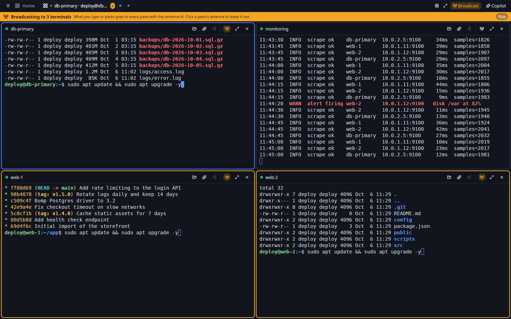
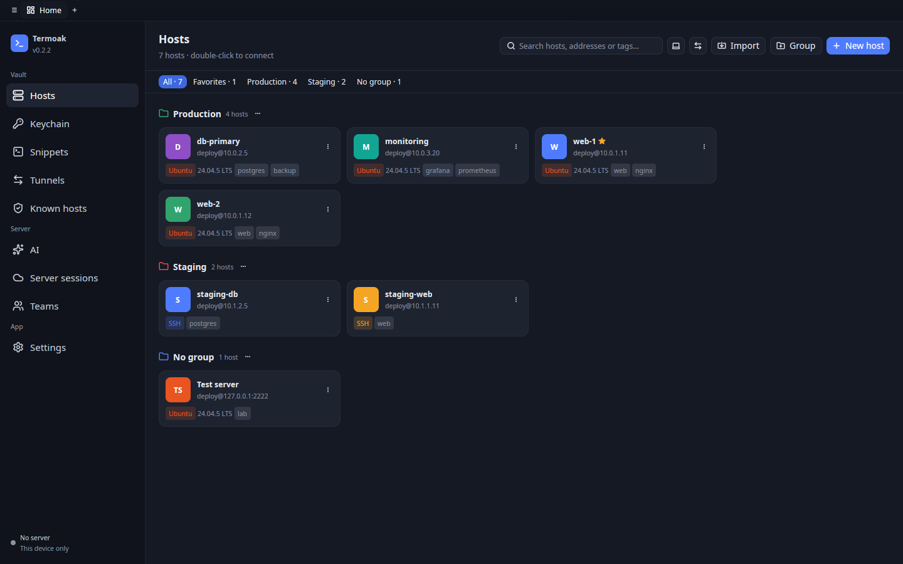
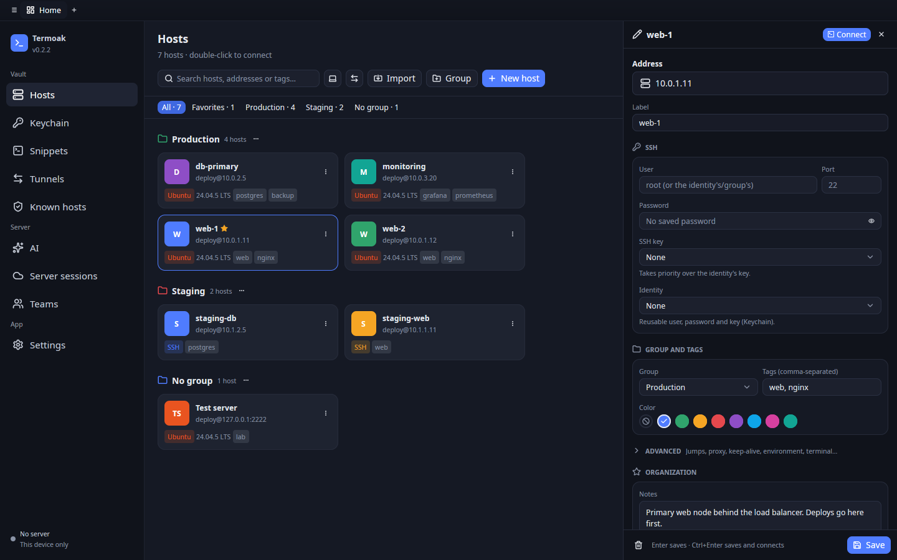
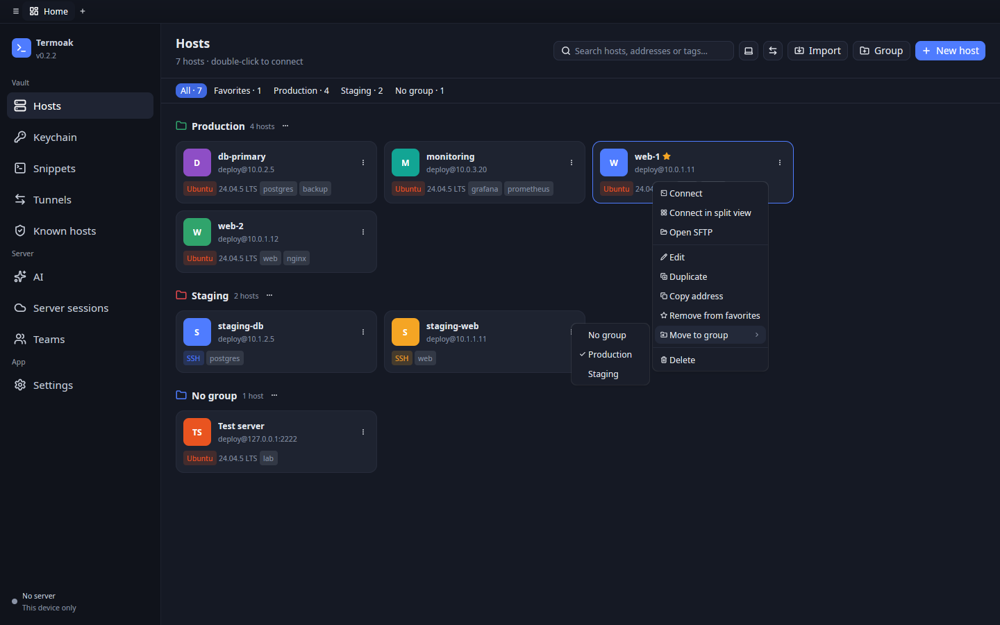
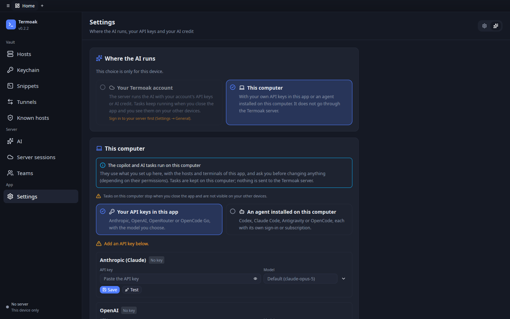
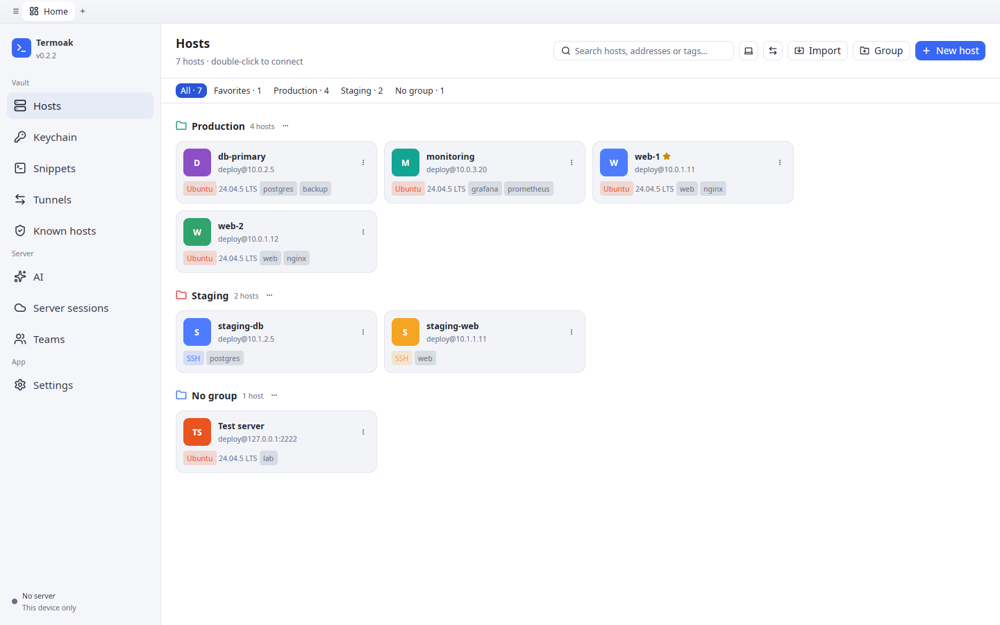

# Termoak for desktop

A **100% native** SSH client for **Windows, Linux and macOS**. No webviews,
no Electron and no Tauri: the interface is built with
[GPUI](https://www.gpui.rs/) (Zed's GPU-accelerated UI framework) and
[gpui-component](https://crates.io/crates/gpui-component), and the terminal
uses [`alacritty_terminal`](https://crates.io/crates/alacritty_terminal) for
VT/xterm emulation, painted directly with GPUI.

Source: https://github.com/TermoakSSH/desktop



*Split view with four SSH terminals and broadcast input on: what you type goes
to every pane with the antenna lit (here, all but the log tail on
`monitoring`).*

<table>
  <tr>
    <td width="50%"><br><em>Hosts by group, with tags, a favorite and the detected system.</em></td>
    <td width="50%"><br><em>The host editor: address first, credentials, group, tags and color.</em></td>
  </tr>
  <tr>
    <td><br><em>Right click on a host: connect, split view, SFTP, favorites, move to group.</em></td>
    <td><br><em>Settings: where the AI runs, with your own API keys or a local agent.</em></td>
  </tr>
  <tr>
    <td><br><em>The light theme.</em></td>
    <td></td>
  </tr>
</table>

## Features

- **Hosts** as cards grouped by group, with search, favorites, tags and the
  operating system detected on connect, with its version ("Ubuntu 24.04.1
  LTS"). A click opens the editor; a double click connects. Groups provide a
  default user and port to their hosts.
- **Host menu** (right click, the "…" button, or Shift+F10 / the menu key on
  the focused card): Connect, Connect in split view, Connect on the server,
  Open SFTP, Edit, Duplicate, Copy address (`user@host:port`), favorite,
  Move to group and Delete. On a group header: Connect to all (one tab per
  host) and Open all in split view.
- **Several hosts at once**: Cmd/Ctrl+click and Shift+click select hosts
  (Cmd/Ctrl+A selects all, Esc clears, arrows move, Enter connects); a bar
  connects them in tabs or in a split view, moves them to a group or
  deletes them.
- **Host editor** (side panel): the address first, then the label (the
  address if empty) and protocol (SSH or Telnet), group, tags, color and
  logo (automatic: the detected system's; or one of the system and generic
  logos); user, port and credentials
  (password, key, identity) with a Connect button at the top; and an
  Advanced section with ProxyJump hops, proxy, agent forwarding, keep-alive,
  startup snippet, environment variables, recording, terminal type and
  terminal theme. Errors show under each field; Enter saves and Ctrl+Enter
  (⌘↩) saves and connects.
- **Import `~/.ssh/config`** ("Import" in Hosts): a preview of what will
  happen (new hosts, skipped ones and why, ProxyJump hops, new and reused
  keys, port forwards and warnings), optionally into a group and as "this
  device only". It can be repeated: what already exists is skipped.
- **Tabs** in the title bar: terminals and SFTP browsers. Drag a tab to
  reorder it (or Ctrl+Shift+PageUp / PageDown). Right click on a tab:
  Rename, Duplicate session, Move to the split view of another tab, Move
  left / right, Close and Close others.
- **Split view**: several terminals in one tab, in a grid that adapts to
  the number (2 side by side, 4 as 2 × 2... up to 16). Drag a tab onto a
  side of the terminal in view to put them side by side (the side lights up
  while dragging); drag a pane by its name to another place of the grid, or
  to the tab bar to give it a tab of its own again (View → Move pane to a
  new tab). Click a pane to focus it, move between panes with
  Cmd+Option+arrows (Ctrl+Alt+arrows), close one, or use focus mode
  (Cmd/Ctrl+Shift+M: the focused pane big and the others small).
- **Broadcast input** in a split view (Cmd+B, Ctrl+Alt+B elsewhere, or the
  Broadcast button): what you type or paste in the focused pane goes to
  every pane, each encoded for its own terminal mode. The included panes
  have an orange border and a lit antenna (click it to leave a pane out),
  and a banner says "Broadcasting to N terminals". "Send snippet" can run a
  snippet in all the panes.
- **Terminal**: colors (16, 256 and true color), bold, italic, underline,
  wide characters and emoji, cursor, scrollback with the mouse wheel, mouse
  selection (double click = word, triple = line), copy and paste (with
  bracketed paste), find in the screen and history (Cmd/Ctrl+Shift+F),
  clear (Cmd+K, Ctrl+Shift+K), automatic resizing and the remote program's
  title.
- **Copy and paste options** (Settings): plain Ctrl+V pasting (off by
  default on Windows and Linux, where Ctrl+V is a control character), what
  the right button does (menu with Copy, Paste, Select all, Clear, Find…;
  paste like PuTTY; or copy the selection and paste otherwise), copy on
  select, and a confirmation before pasting several lines (skipped when the
  program uses bracketed paste).
- **Menus**: the macOS menu bar (Termoak, File, Edit, View, Terminal,
  Window, Help) and, on Windows and Linux, the same menus behind the ☰
  button of the title bar. Help → Keyboard shortcuts lists them all. On
  macOS, the Dock icon's menu has New local terminal, Quick connect, New
  window, Hosts and Server sessions; closing the last window hides the app
  (its tabs and connections stay) and the Dock icon brings it back (Cmd+Q
  quits).
  Authentication prompts in dialogs: fingerprint of new hosts, passwords,
  passphrases and 2FA (keyboard-interactive).
- **Command autocompletion** in SSH and local terminals: while you type, the
  best suggestion (the host's history, one-line snippets and common commands
  of its system: `apt`, `dnf`, `brew`...) appears dimmed after the cursor
  and, if there are several, in a list. Tab or → accepts it and Alt+↑/↓
  picks another; with no suggestion, Tab completes in the shell as usual. It
  suggests nothing inside vim, less... or in prompts without echo
  (passwords), and each host's history is only kept on this device. It can
  be turned off in Settings.
- **International keyboard**: dead keys (´ ¨ ^ ` ~), AltGr, compose
  sequences and IME (Chinese, Japanese, Korean...); text being composed is
  shown underlined at the cursor until confirmed.
- **Mouse in programs**: if the program asks for it (vim with `mouse=a`,
  htop, tmux, mc...), clicks, drags, the wheel and modifiers are sent to it
  (SGR, UTF-8 and X10 encodings). Hold Shift to select text as usual. In
  full-screen programs without mouse support (less, man) the wheel sends
  arrow keys, like xterm.
- **Local terminal**: a shell of this computer in a tab (Ctrl+Shift+T, or
  "Local terminal" in the Ctrl+T picker): `$SHELL` as a login shell on Linux
  and macOS; PowerShell 7, Windows PowerShell or `%COMSPEC%` with ConPTY on
  Windows. If the shell exits, the tab shows the exit code and offers to
  reopen it; closing the tab closes the shell.
- **Telnet**: hosts whose protocol is Telnet (switches, routers, old
  systems) open a Telnet terminal from this computer, through the host's
  proxy if it has one, optionally typing the username and password at the
  first login prompts. Telnet is unencrypted: no keys, jump hosts, SFTP,
  tunnels or server sessions. Quick connect takes `telnet://host:port`, and
  the PuTTY, MobaXterm, SecureCRT, Termius, ZOC and CSV importers bring
  their Telnet sessions as Telnet hosts.
- **Serial port**: open a serial port (USB-serial adapter, router console,
  a board...) as a terminal, picking a detected port or typing its path, and
  the speed (8N1).
- **Run on the server**: signed in to a Termoak server, any host can be
  opened "on the server": the terminal lives there and stays open even if
  you close the app. **Server sessions** lets you get back into them and
  into the ones others share with you. On start, running server sessions
  show up as sleeping tabs that attach when clicked; a green dot in the
  sidebar counts them, and the Home notice about them can be closed (it
  comes back when another one starts).
- **Session sharing**: a local terminal is shared through the server (invite
  by email, share with one of your teams, or create a link for guests
  without an account); server sessions too, from their tab or from **Server
  sessions**. Everyone joins read only and one person types at a time: each
  share says whether guests may ask for the keyboard, when it expires,
  whether you let people in yourself and whether the keyboard is handed over
  without asking (and for how long at most); shares can be changed live or
  revoked. The tab shows who is in and who drives, with your requests to
  answer (also as a toast when the tab is not in view), and lets you give
  the keyboard until you take it back or for 5 to 60 minutes (with a
  countdown next to the driver), take it back, kick or block. **Activity**
  in Server sessions shows who typed and when in a recorded session.
  Guests see a waiting room, ask for and give back the keyboard, and get a
  clear message when they are sent away. **Join with link** (or a
  `termoak://join` link opened from the browser) joins as a guest, no
  account needed.
- **Teams** (needs a server): yours with your role and their members;
  create, rename and delete teams, add members by email, change their role
  (member, admin, owner), remove them and leave. Only what your role allows
  is offered.
- **Administration** (server administrators only): users (create, enable or
  disable, grant or remove administrator, change the password, remove
  two-step verification, list and revoke devices), invitations (create with
  email, team, administrator role and expiry; the code, the `termoak://`
  link and its QR are shown only once; revoke) and the paginated audit log.
- **SFTP** in two panes (this computer ↔ server): browse, upload and
  download files with progress, create folders, rename and delete. From a
  terminal, the "SFTP" button reuses its connection.
- **Keychain**: SSH keys (generate Ed25519/RSA/ECDSA, import
  OpenSSH/PEM/PPK, copy the public key) and reusable identities.
- **Snippets** with `{{name}}` variables and "Run on…" several hosts at once,
  with each one's output.
- **Port forwarding**: local (-L), remote (-R) and dynamic SOCKS5 (-D), with
  start/stop, statistics and automatic start when connecting to the host.
- **Known hosts**: trusted fingerprints, and deleting them.
- **AI** (on your account's server or on this computer): agent tasks in
  *Read only*, *Ask* or *Autonomous* mode, provider picker, live conversation
  (text, reasoning and tools) and follow-up messages. Approval cards show
  what will run: the exact command with its risk and the reasons (pipe,
  `rm -rf`, writes to `/etc`…) or a colored diff of the file it writes, and
  offer *Approve*, *Edit and approve* (what you approve is what runs), *Deny…*
  (with a reason for the AI) and *Approve all in this task*. *Plan before
  acting* (approve or edit a numbered plan first), tasks on a group, a tag or
  several hosts (*Ask AI* in the hosts list; one conversation per host with a
  per-host table), *Stop* and continue, and *Save as runbook* (the commands a
  task ran as a snippet with `{{host}}`). Secrets in what the tools return
  are hidden from the AI provider. Next to each terminal, the **copilot** panel (Ctrl+Shift+I,
  Cmd+I on macOS) chats about that terminal, explains the selection or the
  screen, and suggests commands that are typed into the terminal without
  pressing Enter. It opens with the terminal's context as chips you can
  remove before sending (host and system, directory, last command with its
  exit status and output, selection); obvious secrets (passwords, tokens,
  `Authorization` headers, AWS keys, private keys) are hidden before
  anything from the terminal goes to the AI.
- **AI in the terminal**: when a command fails, a chip at the bottom right
  offers *Explain* (in the copilot, with the command and its output) and
  *Fix* (a corrected command typed at the prompt, never run; can be turned
  off in Settings). Selected text has *Ask AI about this*, *Explain this*
  and *Explain this error* in the right-click menu (Ctrl+Shift+E, Cmd+Shift+E
  on macOS). Type `# what you want` at the prompt and press Ctrl+Enter
  (Cmd+Enter) to get the command in its place, with its explanation and
  risk; dangerous ones ask first.
- **Account and sync** (Settings): sign in (with the two-step verification
  code, or a recovery code, if the account asks for it) or create an account
  (with an invitation code or link, checked while you type: "You will join
  the team…"), automatic encrypted sync every minute and "Sync now".
- **Two-step verification** (Settings): enable it with the QR code for the
  authenticator app (or the key to type it in), see the 10 recovery codes
  only once, and disable it with the password and a code.
- **Dark theme** (default) and **light theme**, terminal font and size, and
  use of the system SSH agent (ssh-agent, Pageant, Windows OpenSSH agent).
- **Automatic updates**: downloaded in the background and **applied on
  restart** (see below).

Local data (hosts, keys, passwords...) is kept in an encrypted database; the
vault key lives in the system keychain (macOS Keychain, Windows Credential
Manager or Secret Service on Linux) and is read once at startup. On macOS,
"Always Allow" only lasts across updates when releases are signed with a
stable identity (see [docs/RELEASING.md](docs/RELEASING.md)). If the
keychain refuses and there is already data, the app shows an error with
"Try again" instead of creating a new key.

## Build and run

The shared crates (SSH engine, vault, API client, AI engine, updates) come
from [TermoakSSH/core](https://github.com/TermoakSSH/core) through a git tag (see `Cargo.toml`); cargo
fetches them.

```sh
cargo run                 # debug
cargo build --release     # optimized binary in target/release/termoak-desktop
cargo test                # tests of the emulator, keyboard, autocompletion...
```

It needs **Rust 1.95 or later** (GPUI uses `std::hint::cold_path`). The
`rust-toolchain.toml` file pins it and `rustup` installs it automatically.

### Linux

Build dependencies (Debian/Ubuntu):

```sh
sudo apt install build-essential pkg-config cmake \
  libxkbcommon-dev libxkbcommon-x11-dev libwayland-dev \
  libx11-xcb-dev libxcb1-dev libfontconfig1-dev libfreetype-dev \
  libvulkan-dev libasound2-dev
```

Fedora: `libxkbcommon-devel libxkbcommon-x11-devel wayland-devel libxcb-devel
fontconfig-devel freetype-devel vulkan-loader-devel alsa-lib-devel`.
Arch: `libxkbcommon libxkbcommon-x11 wayland libxcb fontconfig freetype2
vulkan-icd-loader alsa-lib`.

Running it needs a **Vulkan** driver (your GPU's or, without a GPU,
`mesa-vulkan-drivers`, which includes the *lavapipe* software renderer). It
works on X11 and Wayland. The vault key is stored with Secret Service (GNOME
Keyring, KWallet...); if there is none, a `vault.key` file with 0600
permissions in the data directory is used.

### macOS

Install the Xcode command line tools (`xcode-select --install`). Metal
shaders are compiled at startup, so the full Xcode is not needed.

### Windows

Install the Visual Studio *Build Tools* with "Desktop development with C++"
(MSVC and the Windows 10/11 SDK). In `--release` builds the app opens no
console.

## Environment variables

| Variable | Purpose |
| --- | --- |
| `TERMOAK_HOME` | Data directory (the platform default otherwise). |
| `TERMOAK_VAULT_KEY` | Vault key in base64, instead of the system keychain. |
| `TERMOAK_LOG` | Log filter (`info`, `debug`, `warn,termoak=debug`...). |
| `TERMOAK_UPDATE_URL` | Alternative update manifest (at run time or at build time). |
| `TERMOAK_UPDATE_PUBKEY` | **At build time**: Ed25519 public key (base64) for updates. |

## Automatic updates

1. On start, **before opening any window**, the app applies the update
   downloaded in the previous session and relaunches already updated.
2. While the app is open, every 6 hours it checks the manifest (by default
   `https://github.com/TermoakSSH/desktop/releases/latest/download/latest.json`).
   If there is a new version, it downloads it silently, checks the SHA-256
   and the Ed25519 signature and shows "Update X ready: it will be applied
   on restart" with a **Restart now** button.
3. If the installation is managed by the system (`.deb`, `.rpm`, `/usr`,
   `/opt`, Program Files...), it only notifies: "A new version (X) is
   available", with a download link.
4. As a Flatpak there are no checks at all: Flatpak updates it, and
   Settings → Updates says so (`src/flatpak.rs`).

Updates are only enabled if the binary was built with the public key:

```sh
TERMOAK_UPDATE_PUBKEY=<base64 public key> cargo build --release
```

Releases are signed with the `termoak-release` tool of the `termoak-update`
crate (`keygen` to create the keys and `sign` to sign each artifact and
update `latest.json`). Formats: standalone executable (Windows/Linux),
AppImage (Linux) and `.app` packed in a `.tar.gz` (macOS). See
[SECURITY.md](https://github.com/TermoakSSH/core/blob/main/docs/SECURITY.md#desktop-updates) and
[docs/RELEASING.md](https://github.com/TermoakSSH/desktop/blob/main/docs/RELEASING.md).

## Keyboard shortcuts

| Action | Windows / Linux | macOS |
| --- | --- | --- |
| New tab (pick a host) | Ctrl+T | Cmd+T |
| New local terminal | Ctrl+Shift+T | Cmd+Shift+T |
| Close tab | Ctrl+W (outside the terminal) or Ctrl+Shift+W | Cmd+W |
| Next / previous tab | Ctrl+Tab / Ctrl+Shift+Tab | Ctrl+Tab / Ctrl+Shift+Tab, Cmd+Shift+] / Cmd+Shift+[ |
| Move the tab left / right | Ctrl+Shift+PageUp / Ctrl+Shift+PageDown | Ctrl+Shift+PageUp / Ctrl+Shift+PageDown |
| Back to home | Ctrl+Shift+H | Cmd+1 |
| Show / hide the AI copilot | Ctrl+Shift+I | Cmd+I |
| Explain the selection with AI | Ctrl+Shift+E | Cmd+Shift+E |
| `# request` at the prompt → command (AI) | Ctrl+Enter | Cmd+Enter |
| Copy / paste in the terminal | Ctrl+Shift+C / Ctrl+Shift+V (or Shift+Insert) | Cmd+C / Cmd+V |
| Select the whole terminal | Ctrl+Shift+A | Cmd+A |
| Scroll back up / down | Shift+PageUp / Shift+PageDown | Shift+PageUp / Shift+PageDown |
| Back to the bottom of the scrollback | Shift+End | Shift+End |
| Paste | Middle mouse button | Middle mouse button |
| Select even if the program uses the mouse | Shift + drag | Shift + drag |
| Find in the terminal | Ctrl+Shift+F | Cmd+F |
| Clear the terminal | Ctrl+Shift+K | Cmd+K |
| Settings | Ctrl+, | Cmd+, |
| New window (its own tabs, same data) | File menu (☰) | Cmd+N |
| New host | Ctrl+Shift+N | Cmd+Shift+N |
| Split view: add a terminal | Ctrl+Shift+D | Cmd+D |
| Move between panes | Ctrl+Alt+arrows | Cmd+Option+arrows |
| Focus mode | Ctrl+Shift+M | Cmd+Shift+M |
| Broadcast input to all panes | Ctrl+Alt+B | Cmd+B |
| Send snippet | Ctrl+Shift+S | Cmd+Shift+S |
| Reconnect | Ctrl+Shift+R | Cmd+Shift+R |
| Bigger / smaller / actual size text | Ctrl+= / Ctrl+- / Ctrl+0 | Cmd+= / Cmd+- / Cmd+0 |
| Full screen | F11 | Ctrl+Cmd+F |
| Menu of the focused host | Shift+F10 or the menu key | Shift+F10 |

With an autocompletion suggestion on screen, Tab or → accepts it and
Alt+↑/↓ picks another one from the list.

In the terminal, Ctrl+C, Ctrl+W and Tab go to the remote program, as in any
terminal.

## Layout

```
src/
  main.rs            startup: pending update, tokio, vault and window
  app.rs             main window: tabs, split views, sidebar, sections and AI copilot
  panes.rs           split view logic: grid layout, pane navigation, broadcast routing,
                     where dropped panes land
  drag.rs            dragging tabs and panes: what is dragged, preview, tab order
  windows.rs         several windows on the same data; macOS reopen from the Dock
  menus.rs           menu bar (macOS) and ☰ menu (Windows/Linux), shortcuts list
  dock.rs            menu of the macOS Dock icon
  theme.rs           dark/light themes and terminal palettes
  runtime.rs         bridge between tokio and GPUI
  state.rs           model: data, server session, sync, port forwards
  prompts.rs         authentication prompts (AuthPrompter) with dialogs
  update.rs          automatic updates
  flatpak.rs         running as a Flatpak: no self-updates, host shell
  ui.rs              reusable UI pieces
  qr.rs              QR codes painted with squares
  logos.rs           host logos (system logos in assets/logos, generic icons)
  terminal/          emulation, painting, keyboard (IME), mouse, autocompletion,
                     copy and paste options, find, and connection (local SSH
                     or Telnet, server, local shell or serial port)
  views/             hosts, ssh_config import, host editor, SFTP, keychain,
                     snippets, port forwards, known hosts, AI and copilot,
                     server sessions, sharing, teams, administration,
                     two-step verification, serial port and settings
```

Linux desktop integration lives in `assets/linux/`: the desktop entry, the
AppStream metadata and the icons of `com.termoak.Termoak`, used by the
AppImage, the Linux tar.gz (`share/`) and the Flatpak (`flatpak/`, see
[flatpak/README.md](flatpak/README.md)).

## Working on core at the same time

Point the app to your checkout of core without touching `Cargo.toml`, in a
`.cargo/config.toml` that is not committed:

```toml
[patch."https://github.com/TermoakSSH/core"]
termoak-core = { path = "../core/crates/termoak-core" }
termoak-ssh = { path = "../core/crates/termoak-ssh" }
termoak-client = { path = "../core/crates/termoak-client" }
termoak-update = { path = "../core/crates/termoak-update" }
termoak-ai = { path = "../core/crates/termoak-ai" }
```

## Releases

`scripts/release-local.sh` builds Linux and Windows in Docker and macOS on a
Mac, signs the updates and publishes the `desktop-vX.Y.Z` GitHub release:
see [docs/RELEASING.md](docs/RELEASING.md). The Flatpak is built from
source from the tag: see [flatpak/README.md](flatpak/README.md).

## The Termoak repositories

| Repository | Contents |
|---|---|
| [TermoakSSH/core](https://github.com/TermoakSSH/core) | Shared crates (SSH engine, vault, API client, AI engine, FFI bindings, updates) and the `termoak` CLI |
| [TermoakSSH/server](https://github.com/TermoakSSH/server) | `termoak-server`: HTTP/WebSocket API, basic web app, deployment files |
| **[TermoakSSH/desktop](https://github.com/TermoakSSH/desktop)** | Desktop app (GPUI) for Windows, Linux and macOS |
| [TermoakSSH/mobile-android](https://github.com/TermoakSSH/mobile-android) | Android app (Jetpack Compose) |
| [TermoakSSH/mobile-ios](https://github.com/TermoakSSH/mobile-ios) | iOS app (SwiftUI) |
| [TermoakSSH/public-web](https://github.com/TermoakSSH/public-web) | Public website of termoak.com: landing, pricing and downloads |


## Contributing and translations

Bug reports, fixes, features and translations are welcome: see
[CONTRIBUTING.md](CONTRIBUTING.md). Translating Termoak into your language
needs no programming: copy the English strings file of an app, translate it
and open a pull request ([docs/I18N.md](https://github.com/TermoakSSH/core/blob/main/docs/I18N.md)).

## License

Copyright © Ohz Digital SL.

Termoak is free software released under the
[GNU Affero General Public License v3.0](LICENSE) (AGPL-3.0-only).

"Termoak" and the Termoak logo are trademarks of Ohz Digital SL and are not
covered by the code license: see [TRADEMARK.md](TRADEMARK.md).
