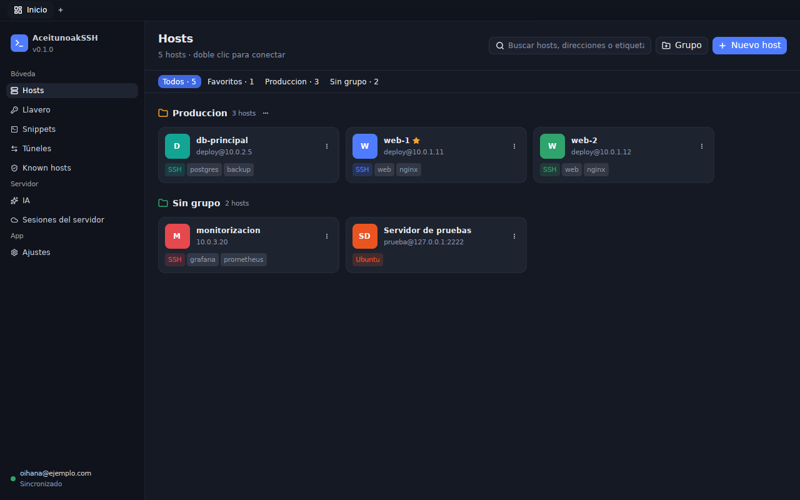
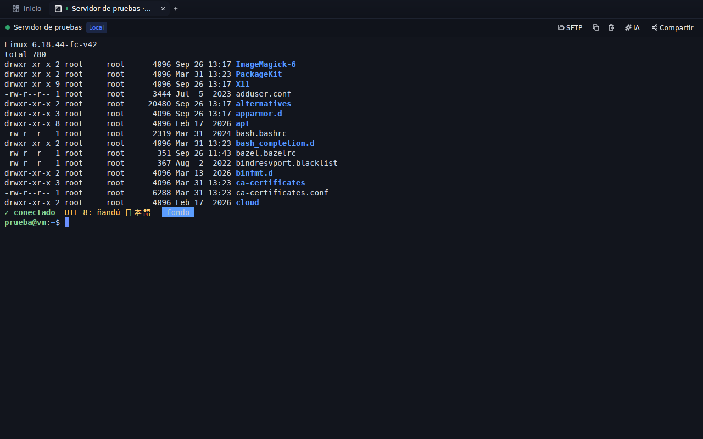

# Termoak for desktop

A **100% native** SSH client for **Windows, Linux and macOS**. No webviews,
no Electron and no Tauri: the interface is built with
[GPUI](https://www.gpui.rs/) (Zed's GPU-accelerated UI framework) and
[gpui-component](https://crates.io/crates/gpui-component), and the terminal
uses [`alacritty_terminal`](https://crates.io/crates/alacritty_terminal) for
VT/xterm emulation, painted directly with GPUI.

Source: https://github.com/TermoakSSH/desktop





## Features

- **Hosts** as cards grouped by group, with search, favorites, tags and the
  operating system detected on connect, with its version ("Ubuntu 24.04.1
  LTS"). A click opens the editor (address, port, user, group, identity,
  key, password, ProxyJump hops, startup snippet, environment variables,
  keep-alive, tags, notes and "this device only"); a double click connects.
  Groups provide a default user and port to their hosts.
- **Import `~/.ssh/config`** ("Import" in Hosts): a preview of what will
  happen (new hosts, skipped ones and why, ProxyJump hops, new and reused
  keys, port forwards and warnings), optionally into a group and as "this
  device only". It can be repeated: what already exists is skipped.
- **Tabs** in the title bar: terminals and SFTP browsers.
- **Terminal**: colors (16, 256 and true color), bold, italic, underline,
  wide characters and emoji, cursor, scrollback with the mouse wheel, mouse
  selection (double click = word, triple = line), copy and paste (with
  bracketed paste), automatic resizing and the remote program's title.
  Authentication prompts in dialogs: fingerprint of new hosts, passwords,
  passphrases and 2FA (keyboard-interactive).
- **Command autocompletion** in SSH and local terminals: while you type, the
  best suggestion (the host's history, one-line snippets and common commands
  of its system: `apt`, `dnf`, `brew`...) appears dimmed after the cursor
  and, if there are several, in a list. Tab or → accepts it and Alt+↑/↓
  picks another; with no suggestion, Tab completes in the shell as usual. It
  suggests nothing inside vim, less... or in prompts without echo
  (passwords), and each host's history is only kept on this device. It can
  be turned off in Settings.
- **International keyboard**: dead keys (´ ¨ ^ ` ~), AltGr, compose
  sequences and IME (Chinese, Japanese, Korean...); text being composed is
  shown underlined at the cursor until confirmed.
- **Mouse in programs**: if the program asks for it (vim with `mouse=a`,
  htop, tmux, mc...), clicks, drags, the wheel and modifiers are sent to it
  (SGR, UTF-8 and X10 encodings). Hold Shift to select text as usual. In
  full-screen programs without mouse support (less, man) the wheel sends
  arrow keys, like xterm.
- **Local terminal**: a shell of this computer in a tab (Ctrl+Shift+T, or
  "Local terminal" in the Ctrl+T picker): `$SHELL` as a login shell on Linux
  and macOS; PowerShell 7, Windows PowerShell or `%COMSPEC%` with ConPTY on
  Windows. If the shell exits, the tab shows the exit code and offers to
  reopen it; closing the tab closes the shell.
- **Serial port**: open a serial port (USB-serial adapter, router console,
  a board...) as a terminal, picking a detected port or typing its path, and
  the speed (8N1).
- **Run on the server**: signed in to a Termoak server, any host can be
  opened "on the server": the terminal lives there and stays open even if
  you close the app. **Server sessions** lets you get back into them and
  into the ones others share with you. On start, running server sessions
  show up as sleeping tabs that attach when clicked.
- **Session sharing**: a local terminal is shared through the server (invite
  by email, share with one of your teams, or create a link for guests
  without an account, with view or control permission); server sessions too,
  from their tab or from **Server sessions**.
- **Teams** (needs a server): yours with your role and their members;
  create, rename and delete teams, add members by email, change their role
  (member, admin, owner), remove them and leave. Only what your role allows
  is offered.
- **Administration** (server administrators only): users (create, enable or
  disable, grant or remove administrator, change the password, remove
  two-step verification, list and revoke devices), invitations (create with
  email, team, administrator role and expiry; the code, the `termoak://`
  link and its QR are shown only once; revoke) and the paginated audit log.
- **SFTP** in two panes (this computer ↔ server): browse, upload and
  download files with progress, create folders, rename and delete. From a
  terminal, the "SFTP" button reuses its connection.
- **Keychain**: SSH keys (generate Ed25519/RSA/ECDSA, import
  OpenSSH/PEM/PPK, copy the public key) and reusable identities.
- **Snippets** with `{{name}}` variables and "Run on…" several hosts at once,
  with each one's output.
- **Port forwarding**: local (-L), remote (-R) and dynamic SOCKS5 (-D), with
  start/stop, statistics and automatic start when connecting to the host.
- **Known hosts**: trusted fingerprints, and deleting them.
- **AI** (needs a server): agent tasks in *Read only*, *Ask* or
  *Autonomous* mode, provider picker, live conversation (text, reasoning and
  tools), approval cards (*Approve*, *Deny*, *Always approve*) and follow-up
  messages. Next to each terminal, the **copilot** panel (Ctrl+Shift+I,
  Cmd+I on macOS) chats about that terminal, explains the selection or the
  screen, and suggests commands that are typed into the terminal without
  pressing Enter.
- **Account and sync** (Settings): sign in (with the two-step verification
  code, or a recovery code, if the account asks for it) or create an account
  (with an invitation code or link, checked while you type: "You will join
  the team…"), automatic encrypted sync every minute and "Sync now".
- **Two-step verification** (Settings): enable it with the QR code for the
  authenticator app (or the key to type it in), see the 10 recovery codes
  only once, and disable it with the password and a code.
- **Dark theme** (default) and **light theme**, terminal font and size, and
  use of the system SSH agent (ssh-agent, Pageant, Windows OpenSSH agent).
- **Automatic updates**: downloaded in the background and **applied on
  restart** (see below).

Local data (hosts, keys, passwords...) is kept in an encrypted database; the
vault key lives in the system keychain (macOS Keychain, Windows Credential
Manager or Secret Service on Linux).

## Build and run

The shared crates (SSH engine, vault, API client, AI engine, updates) come
from [TermoakSSH/core](https://github.com/TermoakSSH/core) through a git tag (see `Cargo.toml`); cargo
fetches them.

```sh
cargo run                 # debug
cargo build --release     # optimized binary in target/release/termoak-desktop
cargo test                # tests of the emulator, keyboard, autocompletion...
```

It needs **Rust 1.95 or later** (GPUI uses `std::hint::cold_path`). The
`rust-toolchain.toml` file pins it and `rustup` installs it automatically.

### Linux

Build dependencies (Debian/Ubuntu):

```sh
sudo apt install build-essential pkg-config cmake \
  libxkbcommon-dev libxkbcommon-x11-dev libwayland-dev \
  libx11-xcb-dev libxcb1-dev libfontconfig1-dev libfreetype-dev \
  libvulkan-dev libasound2-dev
```

Fedora: `libxkbcommon-devel libxkbcommon-x11-devel wayland-devel libxcb-devel
fontconfig-devel freetype-devel vulkan-loader-devel alsa-lib-devel`.
Arch: `libxkbcommon libxkbcommon-x11 wayland libxcb fontconfig freetype2
vulkan-icd-loader alsa-lib`.

Running it needs a **Vulkan** driver (your GPU's or, without a GPU,
`mesa-vulkan-drivers`, which includes the *lavapipe* software renderer). It
works on X11 and Wayland. The vault key is stored with Secret Service (GNOME
Keyring, KWallet...); if there is none, a `vault.key` file with 0600
permissions in the data directory is used.

### macOS

Install the Xcode command line tools (`xcode-select --install`). Metal
shaders are compiled at startup, so the full Xcode is not needed.

### Windows

Install the Visual Studio *Build Tools* with "Desktop development with C++"
(MSVC and the Windows 10/11 SDK). In `--release` builds the app opens no
console.

## Environment variables

| Variable | Purpose |
| --- | --- |
| `TERMOAK_HOME` | Data directory (the platform default otherwise). |
| `TERMOAK_VAULT_KEY` | Vault key in base64, instead of the system keychain. |
| `TERMOAK_LOG` | Log filter (`info`, `debug`, `warn,termoak=debug`...). |
| `TERMOAK_UPDATE_URL` | Alternative update manifest (at run time or at build time). |
| `TERMOAK_UPDATE_PUBKEY` | **At build time**: Ed25519 public key (base64) for updates. |

## Automatic updates

1. On start, **before opening any window**, the app applies the update
   downloaded in the previous session and relaunches already updated.
2. While the app is open, every 6 hours it checks the manifest (by default
   `https://github.com/TermoakSSH/desktop/releases/latest/download/latest.json`).
   If there is a new version, it downloads it silently, checks the SHA-256
   and the Ed25519 signature and shows "Update X ready: it will be applied
   on restart" with a **Restart now** button.
3. If the installation is managed by the system (`.deb`, `.rpm`, `/usr`,
   `/opt`, Program Files...), it only notifies: "A new version (X) is
   available", with a download link.

Updates are only enabled if the binary was built with the public key:

```sh
TERMOAK_UPDATE_PUBKEY=<base64 public key> cargo build --release
```

Releases are signed with the `termoak-release` tool of the `termoak-update`
crate (`keygen` to create the keys and `sign` to sign each artifact and
update `latest.json`). Formats: standalone executable (Windows/Linux),
AppImage (Linux) and `.app` packed in a `.tar.gz` (macOS). See
[SECURITY.md](https://github.com/TermoakSSH/core/blob/main/docs/SECURITY.md#desktop-updates) and
[docs/RELEASING.md](https://github.com/TermoakSSH/desktop/blob/main/docs/RELEASING.md).

## Keyboard shortcuts

| Action | Windows / Linux | macOS |
| --- | --- | --- |
| New tab (pick a host) | Ctrl+T | Cmd+T |
| New local terminal | Ctrl+Shift+T | Cmd+Shift+T |
| Close tab | Ctrl+W (outside the terminal) or Ctrl+Shift+W | Cmd+W |
| Next / previous tab | Ctrl+Tab / Ctrl+Shift+Tab | Ctrl+Tab / Ctrl+Shift+Tab, Cmd+Shift+] / Cmd+Shift+[ |
| Back to home | Ctrl+Shift+H | Cmd+1 |
| Show / hide the AI copilot | Ctrl+Shift+I | Cmd+I |
| Copy / paste in the terminal | Ctrl+Shift+C / Ctrl+Shift+V (or Shift+Insert) | Cmd+C / Cmd+V |
| Select the whole terminal | Ctrl+Shift+A | Cmd+A |
| Scroll back up / down | Shift+PageUp / Shift+PageDown | Shift+PageUp / Shift+PageDown |
| Back to the bottom of the scrollback | Shift+End | Shift+End |
| Paste | Middle mouse button | Middle mouse button |
| Select even if the program uses the mouse | Shift + drag | Shift + drag |

With an autocompletion suggestion on screen, Tab or → accepts it and
Alt+↑/↓ picks another one from the list.

In the terminal, Ctrl+C, Ctrl+W and Tab go to the remote program, as in any
terminal.

## Layout

```
src/
  main.rs            startup: pending update, tokio, vault and window
  app.rs             main window: tabs, sidebar, sections and AI copilot
  theme.rs           dark/light themes and terminal palettes
  runtime.rs         bridge between tokio and GPUI
  state.rs           model: data, server session, sync, port forwards
  prompts.rs         authentication prompts (AuthPrompter) with dialogs
  update.rs          automatic updates
  ui.rs              reusable UI pieces
  qr.rs              QR codes painted with squares
  terminal/          emulation, painting, keyboard (IME), mouse, autocompletion
                     and connection (local SSH, server, local shell or serial port)
  views/             hosts, ssh_config import, host editor, SFTP, keychain,
                     snippets, port forwards, known hosts, AI and copilot,
                     server sessions, sharing, teams, administration,
                     two-step verification, serial port and settings
```

## Working on core at the same time

Point the app to your checkout of core without touching `Cargo.toml`, in a
`.cargo/config.toml` that is not committed:

```toml
[patch."https://github.com/TermoakSSH/core"]
termoak-core = { path = "../core/crates/termoak-core" }
termoak-ssh = { path = "../core/crates/termoak-ssh" }
termoak-client = { path = "../core/crates/termoak-client" }
termoak-update = { path = "../core/crates/termoak-update" }
termoak-ai = { path = "../core/crates/termoak-ai" }
```

## Releases

`scripts/release-local.sh` builds Linux and Windows in Docker and macOS on a
Mac, signs the updates and publishes the `desktop-vX.Y.Z` GitHub release:
see [docs/RELEASING.md](docs/RELEASING.md).

## The Termoak repositories

| Repository | Contents |
|---|---|
| [TermoakSSH/core](https://github.com/TermoakSSH/core) | Shared crates (SSH engine, vault, API client, AI engine, FFI bindings, updates) and the `termoak` CLI |
| [TermoakSSH/server](https://github.com/TermoakSSH/server) | `termoak-server`: HTTP/WebSocket API, basic web app, deployment files |
| **[TermoakSSH/desktop](https://github.com/TermoakSSH/desktop)** | Desktop app (GPUI) for Windows, Linux and macOS |
| [TermoakSSH/mobile-android](https://github.com/TermoakSSH/mobile-android) | Android app (Jetpack Compose) |
| [TermoakSSH/mobile-ios](https://github.com/TermoakSSH/mobile-ios) | iOS app (SwiftUI) |
| [TermoakSSH/public-web](https://github.com/TermoakSSH/public-web) | Public website of termoak.com: landing, pricing and downloads |


## Contributing and translations

Bug reports, fixes, features and translations are welcome: see
[CONTRIBUTING.md](CONTRIBUTING.md). Translating Termoak into your language
needs no programming: copy the English strings file of an app, translate it
and open a pull request ([docs/I18N.md](https://github.com/TermoakSSH/core/blob/main/docs/I18N.md)).

## License

Copyright © Ohz Digital SL.

Termoak is free software released under the
[GNU Affero General Public License v3.0](LICENSE) (AGPL-3.0-only).

"Termoak" and the Termoak logo are trademarks of Ohz Digital SL and are not
covered by the code license: see [TRADEMARK.md](TRADEMARK.md).
